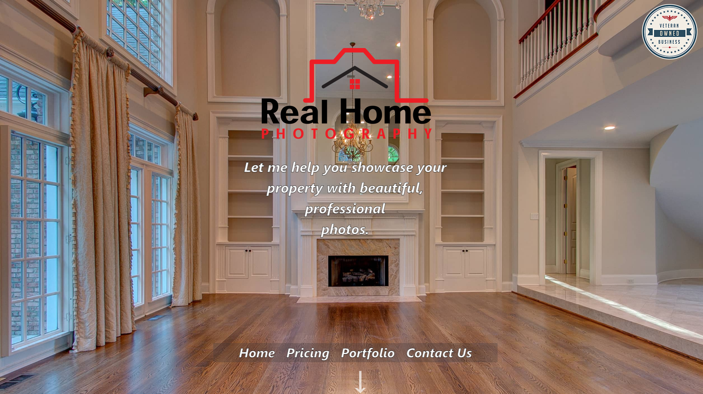
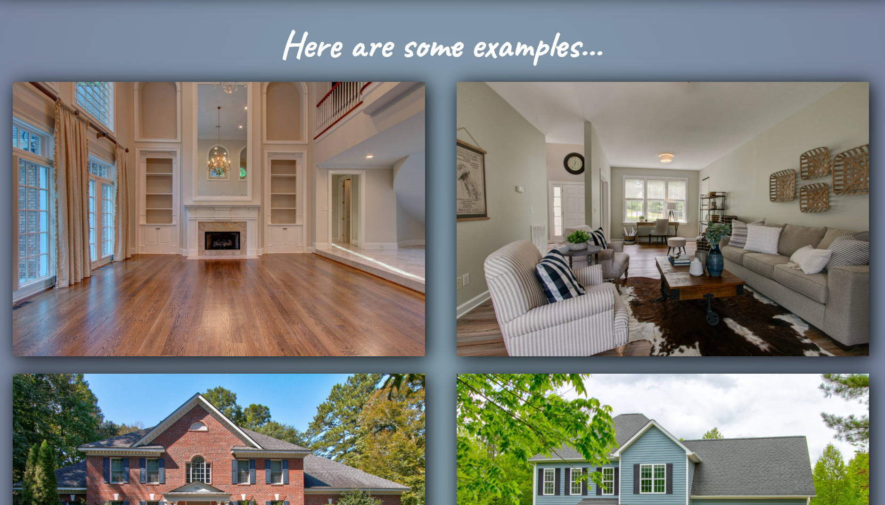
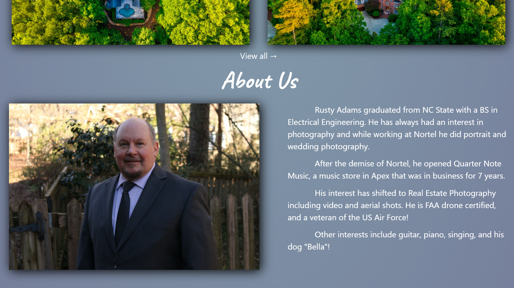
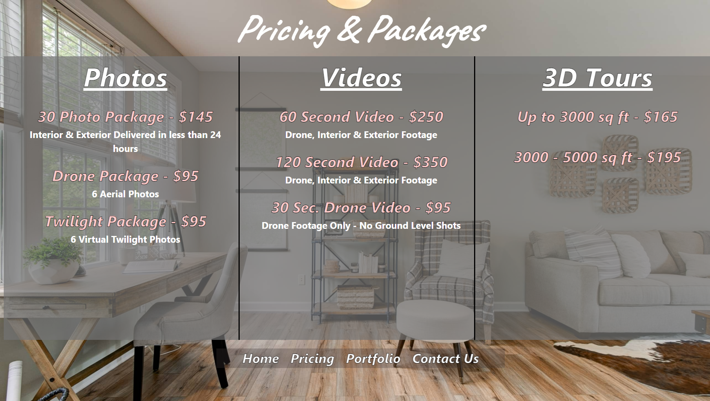
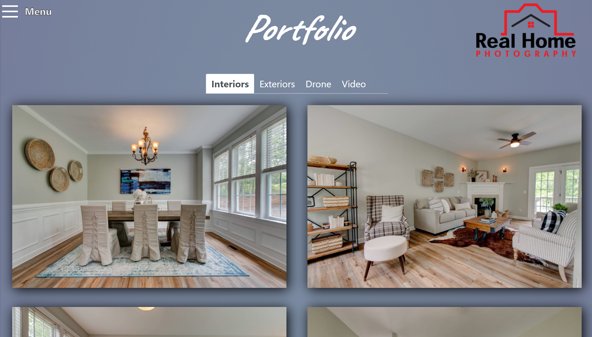
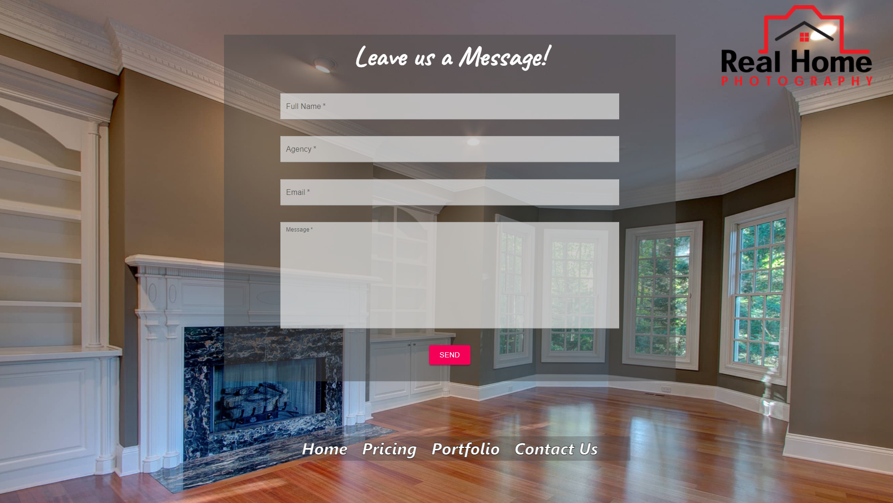

# Real Home Photography Website

### Made for a local real estate photography company.

### Developed with mainly ReactJS and Bootstrap.

### Deployed with Firebase on www.rhomephotography.com

## To run the project, run the following command in the project directory:
  - `npm start`

## This project I did from start to finish allowed me to learn a lot   about React,CSS, HTML, and web development as a whole.

## I used the following libraries to make this website complete:
  - <b></b> ( For links to different pages )
  - <b></b> ( For styling of contact form )
  - <b></b> ( For styling of other pages )
  - <b></b> ( For animations done with images )
  - <b></b> ( For MediaQuery tags to improve responsiveness )
  - <b></b> ( For deployment )
  - <b></b> ( For sending emails from the contact form )

# Front page

### Examples of images, appears with a fade in as the user scrolls down.

### About Us Section, also fades in.

# Pricing Page

# Portfolio Page

# Contact Us Page

